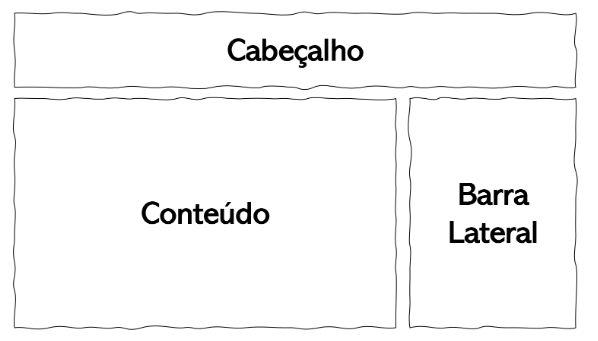
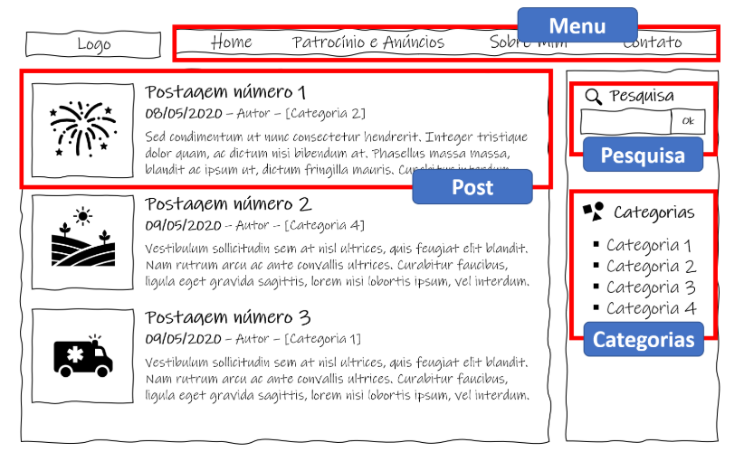
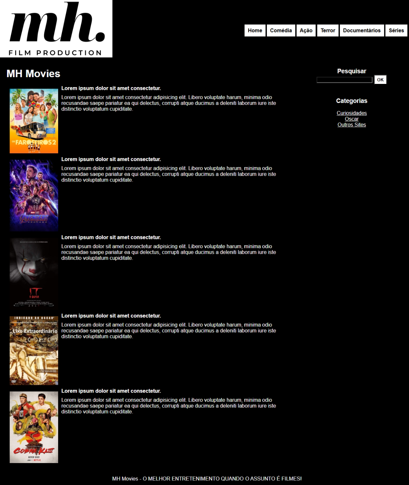

# Trabalho Prático - Semana 03

Dessa vez, vamos escolher uma proposta de projeto para trabalhar. Na [lista de propostas de projetos](propostas-projetos.md), escolha um dentre as alternativas.

Nessa atividade, você deverá montar a página inicial do projeto escolhido, a organização do HTML aplicando semântica correta e uso aprimorado do CSS. Leia o enunciado completo no Canvas para mais detalhes.

**IMPORTANTE:** Você deve trabalhar e alterar apenas arquivos dentro da pasta **`public`**. Deixe todos os demais arquivos e pastas desse repositório inalterados. **PRESTE MUITA ATENÇÃO NISSO.**

## Informações Gerais

- Nome: Matheus Henrique Borges Ferreira
- Matricula: 881020
- Proposta de projeto escolhida: Catálogo de Filmes
- Breve descrição sobre seu projeto: A ideia principal é criar um site funcional, com (a pricípio) características de filmes específicos (sinopse, elenco, entre outros), mas com possibilidade de adição de novos filmes no futuro. Além disso, terá uma parte focada nas curiosidades do cinema e no maior prêmio da história da cinematografia (Oscar).

## Print do esboço criada
Meu esboço ficou IGUAL ao exemplo criado pelo Rommel, mas com pequenas alterações feitas no códigos HTML e CSS.

## Print da home-page criada

